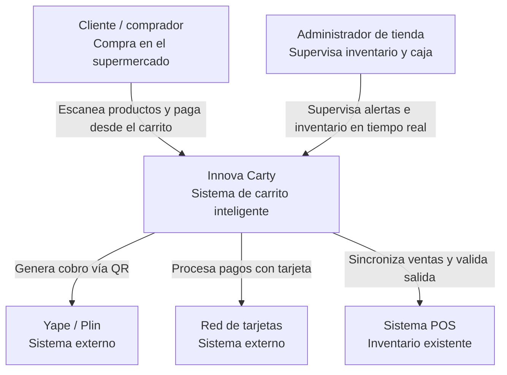

  

  Universidad Peruana de Ciencias Aplicadas 
  Carrera de Ingeniería de Software

 

  <strong> 1ASI0572 Desarrollo de Soluciones IoT</strong>

  NRC: 8721

  Docente: Javier Antonio Prudencio Vidal

  <strong>Informe de Avance (AV1)</strong>

 

  Equipo

  <strong>[Nombre del equipo]</strong>

 

  Proyecto

  <strong>Innova Carty</strong>

 

  <strong>Integrantes</strong>

<table style="margin: 0 auto; border-collapse:collapse; border:none;">
  <tr>
    <th align="left" style="border:none; padding:0.3em 1.5em 0.3em 0;">
      <strong style="font-size:1.1em;">Código</strong>
    </th>
    <th align="left" style="border:none; padding:0.3em 0;">
      <strong style="font-size:1.1em;">Apellidos y Nombres</strong>
    </th>
  </tr>
  <tr>
    <td style="border:none; padding:0.3em 1.5em 0.3em 0;">U20201B29</td>
    <td style="border:none; padding:0.3em 0;">Berrocal Ramirez Omar Christian</td>
  </tr>
  <tr>
    <td style="border:none; padding:0.3em 1.5em 0.3em 0;">U202120569</td>
    <td style="border:none; padding:0.3em 0;">Crisanto Calle Deybbi anderson</td>
  </tr>
  <tr>
    <td style="border:none; padding:0.3em 1.5em 0.3em 0;">U20231D534</td>
    <td style="border:none; padding:0.3em 0;">Diaz Fiestas Jorge Luis</td>
  </tr>
  <tr>
    <td style="border:none; padding:0.3em 1.5em 0.3em 0;">U202215285</td>
    <td style="border:none; padding:0.3em 0;">Huanca Navarro Gustavo Esau</td>
  </tr>
  <tr>
    <td style="border:none; padding:0.3em 1.5em 0.3em 0;">U20211d760</td>
    <td style="border:none; padding:0.3em 0;">Paico Calderon, July Zelmira</td>
  </tr>
  <tr>
    <td style="border:none; padding:0.3em 1.5em 0.3em 0;">U20221A525</td>
    <td style="border:none; padding:0.3em 0;">Pardo Chumpitazi, Kevin Patrick</td>
  </tr>
  <tr>
    <td style="border:none; padding:0.3em 1.5em 0.3em 0;">U201912401</td>
    <td style="border:none; padding:0.3em 0;">Trillo Hernandez, Anghel Melanie</td>
  </tr>
</table>

 

Setiembre 2026

---

# Registro de versiones del Informe

| Versión | Fecha      | Autor(es)                                                                                                                                                                                                                                        | Descripción de modificación                                                                                                                                                 |
|---------|------------|--------------------------------------------------------------------------------------------------------------------------------------------------------------------------------------------------------------------------------------------------|-----------------------------------------------------------------------------------------------------------------------------------------------------------------------------|
| 1       | 15/09/2026 | Berrocal Ramirez Omar Christian   Crisanto Calle Deybbi Anderson   Diaz Fiestas Jorge Luis   Huanca Navarro Gustavo Esau   Paico Calderon, July Zelmira   Pardo Chumpitazi, Kevin Patrick   Trillo Hernandez, Anghel Melanie   | Capítulo I: Introducción   Capítulo II: Requirements Elicitation & Analysis.   Capítulo III: Requirements Specification.   Capítulo IV: Solution Software Design.  |

---

## Contenido

### [ABET – EAC - Student Outcome](#abet--eac---student-outcome-5)

### [Capítulo I: Introducción](#capítulo-i-introducción)
- [1.1. Startup Profile](#11-startup-profile)
  - [1.1.1. Descripción de la Startup](#111-descripción-de-la-startup)
  - [1.1.2. Perfiles de integrantes del equipo](#112-perfiles-de-integrantes-del-equipo)
- [1.2. Solution Profile](#12-solution-profile)
  - [1.2.1. Antecedentes y problemática](#121-antecedentes-y-problemática)
  - [1.2.2. Lean UX Process](#122-lean-ux-process)
    - [1.2.2.1. Lean UX Problem Statements](#1221-lean-ux-problem-statements)
    - [1.2.2.2. Lean UX Assumptions](#1222-lean-ux-assumptions)
    - [1.2.2.3. Lean UX Hypothesis Statements](#1223-lean-ux-hypothesis-statements)
    - [1.2.2.4. Lean UX Canvas](#1224-lean-ux-canvas)
- [1.3. Segmentos objetivo](#13-segmentos-objetivo)

### [Capítulo II: Requirements Elicitation & Analysis](#capítulo-ii-requirements-elicitation--analysis)
- [2.1. Competidores](#21-competidores)
- [2.2. Entrevistas](#22-entrevistas)
- [2.3. Needfinding](#23-needfinding)
- [2.4. Big Picture EventStorming](#24-big-picture-eventstorming)
- [2.5. Ubiquitous Language](#25-ubiquitous-language)

### [Capítulo III: Requirements Specification](#capítulo-iii-requirements-specification)
- [3.1. User Stories](#31-user-stories)
- [3.2. Impact Mapping](#32-impact-mapping)
- [3.3. Product Backlog](#33-product-backlog)

### [Capítulo IV: Solution Software Design](#capítulo-iv-solution-software-design)
- [4.1. Strategic-Level Domain-Driven Design](#41-strategic-level-domain-driven-design)
- [4.2. Tactical-Level Domain-Driven Design](#42-tactical-level-domain-driven-design)
  - [4.2.1. Bounded Context: \[Nombre\]](#421-bounded-context)
  - [4.2.2. Bounded Context: \[Nombre\]](#422-bounded-context)

### [Capítulo V: Solution UI/UX Design](#capítulo-v-solution-uiux-design)
- [5.1. Style Guidelines](#51-style-guidelines)
- [5.2. Information Architecture](#52-information-architecture)
- [5.3. Landing Page UI Design](#53-landing-page-ui-design)
- [5.4. Applications UX/UI Design](#54-applications-uxui-design)
- [5.5. Applications Prototyping](#55-applications-prototyping)
- [5.6. IoT Device Design](#56-iot-device-design)

### [Capítulo VI: Product Implementation, Validation & Deployment](#capítulo-vi-product-implementation-validation--deployment)
- [6.1. Software Configuration Management](#61-software-configuration-management)
- [6.2. Landing Page, Services & Applications Implementation](#62-landing-page-services--applications-implementation)
- [6.3. Validation Interviews](#63-validation-interviews)
- [6.4. Video About-the-Product](#64-video-about-the-product)

### [Conclusiones](#conclusiones)

### [Bibliografía](#bibliografía)

Delgado De La Vega, F. L. (2026). *Impacto de la calidad del servicio sobre la satisfacción de clientes en supermercados del distrito de San Borja* [Tesis de maestría, Universidad San Ignacio de Loyola]. Repositorio Institucional USIL. https://repositorio.usil.edu.pe/server/api/core/bitstreams/ee6274c8-9c66-4253-a9ac-061089c0a4d2/content

Vega, M., Sánchez, E., & Andia, A. (2025). *Diseño e implementación del piloto de CBDC minorista en Perú* (Documento de Trabajo DT. N°. 2025-003). Banco Central de Reserva del Perú (BCRP). https://www.bcrp.gob.pe/docs/Publicaciones/Documentos-de-Trabajo/2025/documento-de-trabajo-003-2025.pdf

Villalobos Paz, O. E. (2023). *Implementación de Lean Management para reducir la merma en la categoría de carnes rojas de una cadena de supermercados* [Tesis de pregrado, Universidad San Ignacio de Loyola]. Repositorio Institucional USIL. https://repositorio.usil.edu.pe/server/api/core/bitstreams/c87882f3-3aba-4144-b03a-17371dc5dc8a/content

Yuziv Duda, I. (2024). *Desarrollo de un carrito de compras inteligente con tecnologías RFID* [Trabajo de fin de grado, Universitat Politècnica de Catalunya]. UPCommons. https://upcommons.upc.edu/server/api/core/bitstreams/97602e01-0e36-4bfa-b24a-db590a741147/content

### [Anexos](#anexos)

---

## ABET – EAC - Student Outcome 5

**Criterio:**
La capacidad de funcionar efectivamente en un equipo cuyos miembros juntos proporcionan liderazgo, crean un entorno de colaboración e inclusivo, establecen objetivos, planifican tareas y cumplen objetivos.

En el siguiente cuadro se describen las acciones realizadas y conclusiones del grupo que sustentan el logro del criterio. *(Completar por cada integrante y por cada entrega — AV1, TB1, AV2, TB2, etc.)*

| Criterio específico | Acciones realizadas | Conclusiones |
|--------------------|--------------------|--------------|
| Trabaja en equipo para proporcionar liderazgo en forma conjunta | **[Apellidos, Nombres] (AV1)**   [Describir en qué participó: qué diseñó, qué bounded context o módulo lideró, con quién coordinó]    **[Apellidos, Nombres] (AV1)**   [...] | **Conclusión general:**   [Resumen de cómo se distribuyó el liderazgo entre el equipo] |
| Crea un entorno colaborativo e inclusivo, establece metas, planifica tareas y cumple objetivos | **[Apellidos, Nombres] (AV1)**   [Describir cómo fomentó la colaboración: tableros usados, seguimiento de tareas, coordinación de plazos]    **[Apellidos, Nombres] (AV1)**   [...] | **Conclusión general:**   [Resumen de las herramientas/prácticas que usó el equipo para cumplir metas] |

---

# Capítulo I: Introducción

## 1.1. Startup Profile

### 1.1.1. Descripción de la Startup

Innova Carty es una empresa emergente orientada a la innovación tecnológica en el sector *retail*. Nuestra misión es transformar la experiencia de compra en establecimientos físicos mediante la integración de sistemas IoT, Edge Computing y pasarelas de pago digitales. Buscamos eliminar las fricciones tradicionales en el proceso de compra, como las largas colas en caja y la falta de control en tiempo real sobre el presupuesto del consumidor, dotando a los carritos de supermercado de capacidades autónomas, analíticas y de seguridad.

### 1.1.2. Perfiles de integrantes del equipo

| **Integrante** | **Perfil** | **Foto** |
|----------------|------------|----------|
| **Jorge Luis Díaz Fiestas**    **Código:** U20231D534    **Carrera:** Ingeniería de Software    **Rol:** Miembro de equipo | Fullstack Developer e IA Automation Specialist. Con experiencia en arquitecturas distribuidas, desarrollo frontend/backend (React, TypeScript, NestJS, Python) y automatización. En el proyecto lidera el diseño del Edge API, la integración del microcontrolador ESP32 y la sincronización con la nube. | |
| **[Apellidos y Nombres]**  Omar Christian Berrocal Ramirez  **Código:** U20201B529    **Carrera:** Ingeniería de Software    **Rol:** Miembro de equipo | Con experiencia en desarrollo fullstack de sistemas y su arquitectura. En el proyecto colabora en la planificación y desarrollo de los servicios. |  |
| **Pardo Chumpitazi, Kevin Patrick**    **Código:** U20221A525    **Carrera:** Ingeniería de Software    **Rol:** Miembro de equipo | Estudiante de Ingeniería de Software con interés en el desarrollo de software orientado a arquitecturas web y servicios distribuidos. Posee conocimientos en lenguajes de programación como Java, C#, TypeScript y bases de datos relacionales. En el proyecto colabora en la especificación de requisitos, diseño de bounded contexts y soporte en la integración de servicios. |  |
| **[Apellidos y Nombres]**    **Código:** [código]    **Carrera:** [carrera]    **Rol:** Miembro de equipo | [Breve perfil] | `assets/common/team/[nombre].jpg` |

---

## 1.2. Solution Profile

En esta sección, se presenta en detalle el perfil de la solución, respaldado por un sólido fundamento de antecedentes y desarrollado de manera metódica, siguiendo el proceso de Lean UX.

### 1.2.1. Antecedentes y problemática

#### A. Antecedentes y Contexto de la Problemática
El sector comercial minorista (*retail*) y las cadenas de supermercados atraviesan una profunda transformación en sus modelos operativos y de atención al cliente. En el contexto peruano, el comercio moderno representa una porción estratégica del Producto Bruto Interno y del empleo formal; no obstante, los establecimientos físicos enfrentan tensiones críticas derivadas de la ineficiencia de las cajas registradoras convencionales, las cuales operan de forma centralizada y secuencial. Esta fricción operativa genera cuellos de botella y tiempos de espera desproporcionados en horarios de alta afluencia, deteriorando la satisfacción neta del cliente (CSAT) y elevando la tasa de abandono de carritos. Estudios sobre la calidad del servicio en el sector retail metropolitano demuestran que los consumidores locales son altamente exigentes y priorizan la seguridad, la agilidad en la atención y la certidumbre transaccional como factores determinantes de su fidelidad (Delgado De La Vega, 2026). Paralelamente, la adopción de medios de pago móviles en el Perú se ha acelerado de manera sostenida: reportes oficiales del Banco Central de Reserva del Perú (Vega et al., 2025) evidencian que las billeteras digitales y las transferencias interoperables mediante códigos QR concentran más del 70% de las operaciones de bajo valor, consolidando un estándar cotidiano que la infraestructura tradicional de los supermercados todavía no aprovecha en un esquema de autoservicio desatendido.

Por otro lado, desde la perspectiva de las operaciones de tienda, las pérdidas económicas ocasionadas por mermas y salidas de mercancía no registradas representan un riesgo crítico. En cadenas de supermercados locales, los desajustes operativos y la falta de mecanismos tecnológicos automatizados para el seguimiento de existencias pueden representar mermas superiores al 5% de las ventas en volumen y comprometer más del 15% del margen de utilidad (Villalobos Paz, 2023). Si bien a nivel internacional se ha demostrado la viabilidad técnica de emplear identificación por radiofrecuencia (RFID) para el rastreo simultáneo de artículos en carritos de compra (Yuziv Duda, 2024), las soluciones comerciales actuales o bien trasladan la incomodidad al usuario forzándolo a utilizar su teléfono móvil personal durante todo el trayecto (*Scan & Go*), o bien dependen de hardware físico tradicional (POS bancarios) que encarece la implementación y eleva los costos de mantenimiento.

#### B. Diagnóstico Situacional: The 5 'W's y 2 'H's
Para sistematizar la problemática identificada en el dominio de estudio, se aplicó la técnica analítica de las 5 'W's y 2 'H's:

* **Who (Quién):** Clientes habituales de supermercados (consumidores digitalizados que requieren optimizar su tiempo y controlar su presupuesto de compra) y administradores de operaciones retail responsables del control de inventarios, prevención de pérdidas y supervisión del piso de venta.
* **What (Qué):** Pérdida de tiempo excesiva en filas de facturación tradicionales, falta de visibilidad del monto total acumulado durante el trayecto en tienda y riesgo operativo de sustracción o salida de mercancía sin registrar pago (merma comercial).
* **Where (Dónde):** Hipermercados y supermercados físicos de formato autoservicio situados en zonas urbanas de alta densidad comercial.
* **When (Cuándo):** En franjas horarias de máxima afluencia (fines de semana, quincenas y fechas festivas), donde el tiempo de permanencia en la cola de caja llega a superar al tiempo empleado en la selección de productos.
* **Why (Por qué):** La arquitectura de cobro actual es centralizada, análoga y secuencial; los clientes carecen de herramientas interactivas embebidas en el carrito para auditar su presupuesto en vivo, y las tiendas no disponen de una validación cruzada automática (peso y sensórica) antes de que el cliente cruce la salida.
* **How (Cómo):** El consumidor se entera del costo final únicamente al llegar al mostrador de caja, exponiéndose a descuidos presupuestarios o solicitudes de retiro de productos frente a la cajera, mientras que la tienda asume costos de congestión operativa y desbalance de inventarios en sus pasillos.
* **How Much (Cuánto):** Incremento directo en el abandono de carritos, disminución en los índices de satisfacción del cliente (CSAT) y pérdidas operativas por mermas comerciales que pueden comprometer más del 15% de la rentabilidad neta de la categoría (Villalobos Paz, 2023).

#### C. Enunciado del Problema (Problem Statement)
Los consumidores frecuentes de supermercados en áreas urbanas enfrentan una experiencia de compra ineficiente caracterizada por largos tiempos de espera en cajas registradoras y la imposibilidad de monitorear su presupuesto en tiempo real, lo que genera insatisfacción y deserción de compra. Al mismo tiempo, los operadores de retail sufren pérdidas financieras significativas derivadas de mermas comerciales y cuellos de botella en la facturación. Esta situación se debe a la persistencia de mecanismos de cobro centralizados y a la carencia de unidades de compra inteligentes que integren verificación física de productos y cobro digital desatendido en el propio punto de recolección.

#### D. Puntos Clave que Resuelve la Solución
La plataforma **Innova Carty** resuelve los aspectos críticos del problema mediante:
1. **Autonomía y Eliminación de Colas:** Habilita el cobro sin cajero (*Cashierless Checkout*) directamente en la unidad móvil mediante la lectura automática de artículos vía RFID y la liquidación instantánea por códigos QR interoperables (Yape/Plin).
2. **Control Presupuestario en Tiempo Real:** Proporciona una pantalla táctil integrada (*On-Cart Display*) que actualiza el balance acumulado con cada producto agregado o retirado, notificando al usuario mediante alertas visuales si alcanza el umbral de su presupuesto límite asignado.
3. **Prevención Automatizada de Mermas:** Realiza una conciliación cruzada inmediata entre la lectura de las etiquetas RFID y el incremento de masa registrado por celdas de carga (*Weight Confirmation*), bloqueando el flujo de pago ante inconsistencias o desvíos perimetrales no autorizados (*Geofencing*).

#### E. Objetivos y Restricciones del Proyecto
* **Objetivo General:** Desarrollar un sistema de carrito de compras inteligente con tecnología IoT, procesamiento en el borde (Edge API), servicios RESTful en la nube y aplicaciones de usuario para agilizar el proceso de compra, controlar el presupuesto del consumidor y mitigar mermas operativas en supermercados.
* **Objetivos Específicos:**
  1. Diseñar e implementar un prototipo físico de Smart Cart equipado con lector RFID, celda de carga de peso y pantalla interactiva para la recolección autónoma de artículos.
  2. Implementar un backend en la nube bajo principios de Domain-Driven Design (DDD) y arquitectura orientada a servicios RESTful para gestionar sesiones de compra, telemetría y pasarelas de pago digitales.
  3. Desarrollar una consola web para supervisores de tienda orientada al monitoreo en tiempo real de unidades activas, gestión de inventario y resolución de alertas de auditoría.
  4. Desarrollar un Landing Page responsivo y accesible optimizado con etiquetas SEO para difundir la propuesta de valor del sistema y captar alianzas con establecimientos minoristas.
* **Restricciones y Delimitación del Alcance:**
  * **Conectividad:** La comunicación entre el carrito inteligente y los servicios de backend depende de cobertura de red inalámbrica Wi-Fi local provista en el establecimiento retail.
  * **Ecosistema de Pagos:** El módulo de cobro autónomo se delimita a la generación de códigos QR dinámicos compatibles con billeteras digitales nacionales (Yape/Plin) y pasarelas con confirmación asíncrona vía webhook, sin incorporar datáfonos físicos para tarjetas con chip dentro del carrito.
  * **Categoría de Productos:** La validación automática de peso aplica a mercancía preenvasada y codificada con etiquetas RFID pasivas estandarizadas en catálogo; productos a granel sin empaque previo requieren pesaje y etiquetado previo en balanzas de sección.

### 1.2.2. Lean UX Process

#### 1.2.2.1. Lean UX Problem Statements

> The current state of retail supermarket shopping has focused mainly on serving frequent shoppers through centralized checkout lanes with manual barcode scanning, while leaving store operations managers dependent on reactive security personnel, manual shelf audits, and end-of-day discrepancy reconciliations.
>
> What existing products and services fail to address is the lack of real-time cumulative budget tracking during the in-store customer journey, the complete elimination of physical checkout bottlenecks via autonomous on-cart mobile payments, and the absence of automated cross-validation between item scanning and physical weight to prevent merchandise shrinkage before exit.
>
> Our product, Innova Carty, will address this gap by deploying an IoT-enabled Smart Cart platform equipped with automated RFID sensing, integrated load-cell weight verification at the edge, a dynamic touch display for budget monitoring with instant Peruvian QR payment processing (Yape/Plin), and an operational web console with geofencing security.
>
> Our initial focus will be frequent modern urban shoppers seeking speed and financial control, as well as supermarket operations managers striving to reduce front-end labor bottlenecks and mitigate inventory shrinkage.
>
> We will know we are successful when we observe a 30% reduction in customer checkout waiting times, an 80% adoption rate of QR self-checkout among target shoppers, a 50% decrease in unverified merchandise exit incidents, and a measurable increase in overall store customer satisfaction (CSAT).

#### 1.2.2.2. Lean UX Assumptions

##### Business Assumptions
* We believe that supermarket chain operators are willing to invest in modernizing their shopping cart fleet if it significantly reduces cashier operating expenses and front-end labor bottlenecks.
* We believe that physical retail stores value real-time customer purchasing analytics and on-floor telemetry to optimize product restocking, store layout, and inventory management.
* We believe that retail businesses prioritize accelerating shopper flow and floor rotation during peak demand periods to maximize revenue per square meter.

##### Business Outcome Assumptions
* We believe we will achieve a 30% reduction in average checkout waiting and transaction times across retail branches.
* We believe we will achieve at least a 50% decrease in operational merchandise shrinkage and unauthorized exit losses.
* We believe we will increase frequent customer retention and loyalty by improving overall store customer satisfaction (CSAT) by 25%.
* We believe we will reduce maintenance and operating expenses associated with traditional mechanical checkout lanes by migrating toward autonomous self-checkout stations.

##### User Assumptions
* We believe that modern urban shoppers frequently utilize mobile digital wallets (Yape, Plin) and banking apps for their everyday purchases.
* We believe that supermarket shoppers experience friction, frustration, and social discomfort when subjected to long, slow-moving checkout lines.
* We believe that consumers prefer an integrated self-service unit embedded directly into the cart over using their personal smartphones throughout the entire physical shopping journey.
* We believe that floor supervisors and store security personnel require centralized mobile tools to monitor security alerts and resolve inventory discrepancies without unnecessary manual patrols.

##### User Outcome and Benefit Assumptions
* We believe that consumers will attain financial peace of mind and strict budget control by knowing their cumulative cart balance in real time before paying.
* We believe that users will save between 15 and 20 minutes per grocery visit by completely bypassing traditional cashier lines.
* We believe that shoppers will experience an autonomous, frictionless purchasing journey with zero billing surprises or item-return embarrassment at checkout.
* We believe that store operations managers will attain total real-time traceability and control over cart units in circulation, lowering operational stress related to theft and shrinkage.

##### Feature Assumptions
* We believe that an automated multi-tag UHF RFID reader and antenna array embedded within the cart chassis will instantly register deposited or removed items without manual barcode scanning.
* We believe that a precision load-cell weight confirmation system integrated into the bottom tray of the smart cart will perform edge validation to detect unverified or unscanned merchandise.
* We believe that an interactive on-cart touch display with proactive visual threshold alerts will provide continuous visibility and control over personal shopping budgets.
* We believe that an integrated Peruvian QR payment generator supporting interoperable digital wallets (Yape and Plin) will facilitate instant checkout and electronic exit authorization.
* We believe that an IoT-enabled geofencing security subsystem with automated wheel-locking mechanisms will prevent unauthorized store removals and unverified perimeter exits.

#### 1.2.2.3. Lean UX Hypothesis Statements

Siguiendo la metodología de Lean UX (Gothelf & Seiden, 3rd Edition), se formula un enunciado de hipótesis por cada una de las soluciones funcionales identificadas en los *Feature Assumptions*, empleando la plantilla oficial en inglés:

* **Hypothesis Statement 1 (RFID Automated Scanning):**
  > **We believe we will achieve** a 30% reduction in customer checkout waiting times and higher front-end throughput  
  > **If** frequent supermarket shoppers  
  > **Attain** immediate item identification and zero manual scanning friction while adding or removing products  
  > **With** an automated multi-tag UHF RFID reader and antenna array embedded within the cart chassis.

* **Hypothesis Statement 2 (Load-Cell Weight Verification):**
  > **We believe we will achieve** at least a 50% decrease in merchandise shrinkage and unverified exit losses  
  > **If** supermarket operations managers and loss prevention supervisors  
  > **Attain** immediate edge-level discrepancy validation between physical cart weight and digital item registry  
  > **With** a precision load-cell weight confirmation system integrated into the bottom tray of the smart cart.

* **Hypothesis Statement 3 (On-Cart Budget Display):**
  > **We believe we will achieve** a 25% increase in customer net satisfaction (CSAT) and repeat store visits  
  > **If** budget-conscious urban shoppers  
  > **Attain** continuous financial control and instant visibility over accumulated spending before reaching payment  
  > **With** an interactive on-cart touch display featuring dynamic threshold configurations and proactive visual budget alerts.

* **Hypothesis Statement 4 (Dynamic QR Autonomous Payment):**
  > **We believe we will achieve** an 80% adoption rate of cashierless digital payments and reduced cashier operating expenses  
  > **If** tech-savvy retail consumers  
  > **Attain** a completely autonomous self-checkout experience completed in under sixty seconds without queuing  
  > **With** an integrated dynamic Peruvian QR payment generator supporting interoperable wallets (Yape and Plin) with asynchronous cloud confirmation.

* **Hypothesis Statement 5 (Geofencing Perimeter Security):**
  > **We believe we will achieve** zero unauthorized store cart removals and enhanced asset security across physical retail branches  
  > **If** store security staff and facility administrators  
  > **Attain** automated perimeter enforcement and immediate security telemetry for unverified cart movements  
  > **With** an IoT-enabled geofencing security subsystem with automated wheel-locking mechanisms triggered upon exit line breaches without a verified digital receipt.

  
#### 1.2.2.4. Lean UX Canvas

<table border="1px">
    <thead>
        <tr>
            <th colspan="3" style="text-align: left; font-size: 18px; padding: 10px;">Lean UX Canvas (v2)</th>
        </tr>
    </thead>
    <tbody>
        <tr>
            <td colspan="1" style="width: 33%; vertical-align: top; padding: 10px;">
                

                    <strong>1. Business Problem</strong>
                

                <ul style="font-size: 12px; padding-left: 15px;">
                    <li>Pérdida de tiempo y cuellos de botella en filas de pago tradicionales durante horarios de alta afluencia.</li>
                    <li>Incertidumbre presupuestaria del cliente al no visualizar el costo acumulado durante su recorrido.</li>
                    <li>Pérdidas financieras derivadas de mermas comerciales y salida de mercancía sin registrar pago.</li>
                    <li>Abandono de carritos y saturación del personal de tienda en conciliaciones manuales.</li>
                </ul>
            </td>
            <td rowspan="2" colspan="1" style="width: 34%; vertical-align: top; padding: 10px;">
                

                    <strong>5. Solutions</strong>
                

                <ul style="font-size: 12px; padding-left: 15px;">
                    <li><strong>Smart Cart IoT:</strong> Unidades equipadas con hardware integrado (módulo de lectura RFID, celdas de carga y sistema de geofencing).</li>
                    <li><strong>Validación Edge Local:</strong> Verificación continua entre los productos leídos por radiofrecuencia y la masa registrada por la celda de carga para prevenir mermas.</li>
                    <li><strong>Pantalla Interactiva con QR:</strong> Interfaz embebida en el carrito que muestra el presupuesto en vivo y genera códigos QR dinámicos para pago con Yape o Plin.</li>
                    <li><strong>Web Operations Console:</strong> Plataforma web de administración para supervisión en tiempo real de carritos, telemetría y resolución de alertas de seguridad.</li>
                </ul>
            </td>
            <td colspan="1" style="width: 33%; vertical-align: top; padding: 10px;">
                

                    <strong>2. Business Outcomes</strong>
                

                <ul style="font-size: 12px; padding-left: 15px;">
                    <li>Reducción del 30% en el tiempo promedio de atención y espera en el cobro en tienda.</li>
                    <li>Disminución de al menos el 50% en pérdidas por mermas y salidas no autorizadas de mercancía.</li>
                    <li>Incremento del 25% en la satisfacción neta del cliente (CSAT) y mayor retención.</li>
                    <li>Adopción del 80% del cobro desatendido vía QR interoperable frente a las cajas tradicionales.</li>
                </ul>
            </td>
        </tr>
        <tr>
            <td colspan="1" style="vertical-align: top; padding: 10px;">
                

                    <strong>3. Users</strong>
                

                <ul style="font-size: 12px; padding-left: 15px;">
                    <li><strong>Compradores Frecuentes de Supermercados:</strong> Consumidores urbanos que buscan autonomía, agilidad en sus compras y control estricto de su presupuesto.</li>
                    <li><strong>Administradores de Operaciones Retail:</strong> Supervisores de piso de venta enfocados en agilizar el flujo de clientes y mitigar el riesgo de pérdidas.</li>
                </ul>
            </td>
            <td colspan="1" style="vertical-align: top; padding: 10px;">
                

                    <strong>4. User Outcomes & Benefits</strong>
                

                <ul style="font-size: 12px; padding-left: 15px;">
                    <li><strong>Control Presupuestario en Tiempo Real:</strong> Conocer el saldo acumulado exacto antes del momento de pago, evitando sorpresas.</li>
                    <li><strong>Eliminación de Filas:</strong> Liquidación autónoma e inmediata que ahorra entre 15 y 20 minutos por visita.</li>
                    <li><strong>Trazabilidad y Seguridad:</strong> Supervisión operativa sin fricciones y validación automática de salida.</li>
                </ul>
            </td>
        </tr>
        <tr>
            <!-- 6. Hypotheses -->
            <td colspan="1" style="vertical-align: top; padding: 10px;">
                

                    <strong>6. Hypotheses</strong>
                

                

                    <strong>We believe we will achieve</strong> a 30% reduction in checkout times and 50% less shrinkage  
                    <strong>If</strong> frequent shoppers and store operations managers  
                    <strong>Attain</strong> autonomous scanning, real-time budget tracking, and instant weight discrepancy validation  
                    <strong>With</strong> the Innova Carty IoT platform equipped with RFID, load cells, and on-cart QR payments.
                

            </td>
            <!-- 7. What's the most important thing we need to learn first? -->
            <td colspan="1" style="vertical-align: top; padding: 10px;">
                

                    <strong>7. What's the most important thing we need to learn first?</strong>
                

                <ul style="font-size: 12px; padding-left: 15px;">
                    <li><strong>Aceptación:</strong> ¿Los compradores se adaptan de forma autónoma a la pantalla del carrito sin necesidad de soporte del personal?</li>
                    <li><strong>Precisión:</strong> ¿La validación cruzada RFID y peso detecta mermas sin generar falsas alarmas que incomoden al usuario?</li>
                    <li><strong>Velocidad:</strong> ¿La confirmación asíncrona del pago QR es lo bastante ágil para autorizar la salida en menos de 60 segundos?</li>
                </ul>
            </td>
            <!-- 8. What's the least amount of work we need to do to learn that next important thing? -->
            <td colspan="1" style="vertical-align: top; padding: 10px;">
                

                    <strong>8. What's the least amount of work we need to do to learn that next important thing?</strong>
                

                <ul style="font-size: 12px; padding-left: 15px;">
                    <li><strong>Prototipo Funcional de Banco:</strong> Probar la lectura RFID y la celda de carga en un entorno de pruebas con artículos estándar de retail.</li>
                    <li><strong>Prueba de Usabilidad Checkout QR:</strong> Evaluar la tasa de éxito y el tiempo de respuesta al generar QR dinámicos frente a usuarios muestra.</li>
                    <li><strong>Simulación de Mermas:</strong> Ejecutar pruebas de desbalance intencional de peso para verificar la activación del bloqueo perimetral.</li>
                </ul>
            </td>
        </tr>
    </tbody>
</table>

## 1.3. Segmentos objetivo

Esta sección describe los dos segmentos clave vinculados al dominio de autoservicio minorista de Innova Carty, detallando sus atributos demográficos, psicográficos, conductuales y el sustento estadístico basado en investigaciones del sector.

---

### Segmento 1: Comprador Moderno / Consumidor Final

Consumidores urbanos digitalizados que realizan compras regulares de despensa familiar o personal en supermercados e hipermercados. Este grupo prioriza la optimización de su tiempo, la certidumbre financiera sobre su gasto y la autonomía durante el trayecto en tienda, recurriendo habitualmente a soluciones de cobro digital para evitar fricciones en caja.

| **Aspecto** | **Detalle** |
| :--- | :--- |
| **Rango de edad** | 20 a 50 años (jóvenes adultos, profesionales independientes y jefes de hogar en etapa económicamente activa). |
| **Nivel socioeconómico** | NSE A, B y C (consumidores con poder adquisitivo medio-alto y alta tenencia de teléfonos inteligentes). |
| **Geografía** | Zonas urbanas consolidadas y distritos metropolitanos con alta penetración de canal moderno y cadenas de autoservicio (ej. San Borja, Surco, Miraflores, Lima Metropolitana). |
| **Perfil psicográfico** | Prácticos, organizados, orientados a la tecnología, sensibles a la pérdida de tiempo y conscientes del control de sus gastos personales. |
| **Comportamiento de compra** | Visitas semanales o quincenales a supermercados físicos con listas planificadas de artículos de canasta básica y perecibles. |
| **Estadísticas de sustento** | • **Penetración de pagos móviles:** En el Perú, las transacciones mediante billeteras digitales interoperables (Yape y Plin) alcanzaron aproximadamente 802 millones de operaciones mensuales, representando el 70.1% de los pagos digitales minoristas de bajo valor (Vega et al., 2025). • **Exigencia del consumidor:** En supermercados metropolitanos, la garantía y certidumbre en las transacciones constituye el factor con mayor impacto positivo en la satisfacción del cliente, mientras que las colas de facturación representan la mayor fricción del servicio físico (Delgado De La Vega, 2026). |
| **Problema principal** | Desconocimiento del costo acumulado durante el recorrido (riesgo de exceder su presupuesto) y pérdida excesiva de tiempo en filas de cobro centralizadas durante horas de alta congestión. |

---

### Segmento 2: Administrador de Tienda / Operaciones Retail

Profesionales y directivos encargados de la administración operativa, supervisión de piso de venta, control de inventario y prevención de pérdidas (*shrinkage*) en establecimientos comerciales minoristas. Su objetivo principal es asegurar la rentabilidad del local, agilizar el flujo de atención al cliente y garantizar la concordancia continua entre el inventario teórico y las existencias físicas.

| **Aspecto** | **Detalle** |
| :--- | :--- |
| **Rango de edad** | 25 a 55 años (profesionales titulados, mandos medios o asistentes con experiencia en áreas de administración, ingeniería industrial, logística o retail management). |
| **Rol ocupacional** | Gerentes de tienda, jefes de operaciones de piso, supervisores de prevención de pérdidas y encargados de abastecimiento e inventarios. |
| **Geografía** | Sedes de cadenas de supermercados, hipermercados y tiendas de autoservicio en las principales ciudades del país. |
| **Perfil psicográfico** | Metódicos, analíticos, orientados a métricas de eficiencia operativa (KPIs de merma, rotación de clientes y margen por metro cuadrado) y enfocados en la reducción de costos logísticos. |
| **Estadísticas de sustento** | • **Impacto económico de mermas:** En cadenas de supermercados peruanas, las pérdidas operativas y desajustes de stock en categorías críticas superan el 5% de la venta en volumen físico y comprometen más del 15% del margen de utilidad bruta si no se cuenta con sistemas automatizados de trazabilidad (Villalobos Paz, 2023). • **Efectividad tecnológica:** La implementación de sistemas de radiofrecuencia (RFID) e instrumentación de pesaje ha demostrado viabilidad experimental para automatizar el control de existencias en carritos de compra, eliminando los errores del conteo manual tradicional (Yuziv Duda, 2024; Villalobos Paz, 2023). |
| **Problema principal** | Salida no detectada de mercancía no facturada (mermas comerciales por omisión o sustracción), saturación de cajas registradoras en horarios pico y altos costos operativos de personal en líneas de facturación. |

---

# Capítulo II: Requirements Elicitation & Analysis

## 2.1. Competidores

### 2.1.1. Análisis competitivo ###

<table border="1px">
    <thead>
        <th colspan="11">Competitive Analysis Landscape</th>
    </thead>
    <tbody>
        <tr>
            <td rowspan="2" colspan="2">¿Por qué realizar este análisis?</td>
            <td colspan="9">Indicar en este espacio la pregunta que se busca responder o el propósito principal del análisis.</td>
        </tr>
        <tr>
            <td colspan="9">El propósito de este análisis es entender cómo funcionan y qué características poseen las soluciones de compra inteligente actuales, con el fin de potenciar las ventajas únicas de Innova Carty (pago ágil por QR peruano y control estricto de presupuesto) y aprovechar las barreras de costo y fricción de la competencia.</td>
        </tr>
        <tr>
            <tr>
                <td colspan="3">(En la cabecera colocar nombre y logo de cada competidor)</td>
                <td colspan="2"> Innova Carty (Nuestro)</td>
                <td colspan="2"> Scan & Go (Apps)</td>
                <td colspan="2"> Smart-Cart</td>
                <td colspan="2"> Caper Cart</td>
            </tr>
        </tr>
        <tr>
            <td rowspan="2" colspan="1">Perfil</td>
            <td colspan="2">Descripción general</td>
            <td colspan="2">Carrito inteligente IoT que escanea productos, calcula presupuesto en tiempo real y cobra vía QR local.</td>
            <td colspan="2">Aplicación móvil de supermercados donde el cliente usa su celular para escanear y pagar.</td>
            <td colspan="2">Carrito con tablet y datáfono físico integrado desarrollado para supermercados en Colombia.</td>
            <td colspan="2">Carrito premium con cámaras de IA de visión computacional y sensores de peso.</td>
        </tr>
        <tr>
            <td colspan="2">Ventaja competitiva ¿Qué valor ofrece?</td>
            <td colspan="2">Pagos universales por QR (Yape/Plin), control de límite de gasto y mínima fricción física.</td>
            <td colspan="2">No requiere inversión en hardware físico por parte del supermercado.</td>
            <td colspan="2">Respaldo de red de pagos (Credibanco), permite usar tarjetas de crédito físicas en el carrito.</td>
            <td colspan="2">Experiencia "Throw & Go": el usuario lanza el producto y las cámaras lo reconocen automáticamente.</td>
        </tr>
        <tr>
            <td rowspan="2" colspan="1">Perfil de Marketing</td>
            <td colspan="2">Mercado objetivo</td>
            <td colspan="2">Supermercados y clientes de retail en Perú enfocados en ahorro de tiempo y presupuesto.</td>
            <td colspan="2">Consumidores digitalizados que ya compran en cadenas de supermercados peruanos.</td>
            <td colspan="2">Cadenas de supermercados en Colombia y la región andina.</td>
            <td colspan="2">Grandes corporaciones de retail en Estados Unidos y mercados de primer mundo.</td>
        </tr>
        <tr>
            <td colspan="2">Estrategia de Marketing</td>
            <td colspan="2">Venta B2B destacando fidelización mediante Yape/Plin y la alerta de presupuesto límite.</td>
            <td colspan="2">Promociones in-store y descuentos exclusivos por usar la app del supermercado.</td>
            <td colspan="2">Alianzas corporativas directas entre la red de procesamiento y minoristas.</td>
            <td colspan="2">Presencia en grandes ferias globales de retail y respaldo corporativo de Instacart.</td>
        </tr>
        <tr>
            <td rowspan="3" colspan="1">Perfil de Producto</td>
            <td colspan="2">Producto & Servicio</td>
            <td colspan="2">Hardware (Carrito) con lector, pantalla táctil y software de pagos QR integrado.</td>
            <td colspan="2">Software (App móvil) instalada en el smartphone del usuario final.</td>
            <td colspan="2">Hardware (Carrito) adaptado con un terminal de pago POS robusto.</td>
            <td colspan="2">Hardware (Carrito premium) con tecnología de reconocimiento de imágenes 360°.</td>
        </tr>
        <tr>
            <td colspan="2">Precio & Costos</td>
            <td colspan="2">Costo medio de hardware. Gratuito para el consumidor final.</td>
            <td colspan="2">Inversión en software para el retail. Cero costo de hardware extra por carrito.</td>
            <td colspan="2">Costo alto B2B por la inclusión de terminales POS tradicionales.</td>
            <td colspan="2">Muy alto (miles de dólares) por uso intensivo de cámaras e IA.</td>
        </tr>
        <tr>
            <td colspan="2">Canales</td>
            <td colspan="2">Tiendas físicas retail y demostraciones piloto.</td>
            <td colspan="2">App Store, Google Play y banners en tienda.</td>
            <td colspan="2">Venta corporativa B2B.</td>
            <td colspan="2">Venta corporativa B2B.</td>
        </tr>
        <tr>
            <td rowspan="5">Análisis SWOT</td>
            <td colspan="10">Elabore un análisis para su startup y competidores. Las fortalezas deben respaldar oportunidades y reforzar ventajas competitivas.</td>
        </tr>
        <tr>
            <td colspan="2">Fortalezas</td>
            <td colspan="2">Fuerte enfoque en inclusión financiera (pagos QR) y alertas para no exceder presupuesto.</td>
            <td colspan="2">Escalabilidad inmediata y cero mantenimiento de hardware para el supermercado.</td>
            <td colspan="2">Soporte técnico directo de una gran procesadora de pagos tradicional.</td>
            <td colspan="2">Tecnología de punta, nula fricción al comprar y marca global reconocida.</td>
        </tr>
        <tr>
            <td colspan="2">Debilidades</td>
            <td colspan="2">El desarrollo y mantenimiento del hardware en los locales requiere inversión inicial.</td>
            <td colspan="2">Alta fricción: el usuario gasta batería y maniobra incómodamente con celular y productos.</td>
            <td colspan="2">El POS físico es pesado, tosco y propenso a sufrir daños en el carrito.</td>
            <td colspan="2">Costos prohibitivos para Latam; infraestructura muy compleja de mantener.</td>
        </tr>
        <tr>
            <td colspan="2">Oportunidades</td>
            <td colspan="2">Masiva adopción de billeteras digitales en Perú y demanda por evitar colas.</td>
            <td colspan="2">Integración nativa con programas de fidelidad como CMR o Tarjeta Oh!</td>
            <td colspan="2">Expansión hacia otros países sudamericanos con infraestructura de pagos similar.</td>
            <td colspan="2">Sinergia con ecosistemas de delivery y recolección de macrodatos de consumo.</td>
        </tr>
        <tr>
            <td colspan="2">Amenazas</td>
            <td colspan="2">Vandalismo hacia la pantalla o sensores, y rechazo de cadenas conservadoras.</td>
            <td colspan="2">Baja tasa de retención si el usuario prefiere no usar su teléfono personal.</td>
            <td colspan="2">Reemplazo por tecnologías de pago digital puro (QR) sin terminales físicos.</td>
            <td colspan="2">Tiendas sin cajeros (cámaras en el techo) que volverían obsoletos los carritos.</td>
        </tr>
    </tbody>
</table>

### 2.1.2. Estrategias y tácticas frente a competidores
*(Pendiente — Responsable: July)*

---

## 2.2. Entrevistas

### 2.2.1. Diseño de entrevistas

**Objetivo de las entrevistas:** Validar (o refutar) las suposiciones clave del Lean UX Canvas —que los compradores frecuentes desconocen cuánto llevan gastado durante su recorrido, y que los administradores de tienda enfrentan pérdidas operativas por mercancía no registrada y cuellos de botella en caja— antes de avanzar con el diseño de la solución.

**Metodología:** Entrevistas semiestructuradas de 5–10 minutos, presenciales o virtuales, considerando al menos 5 personas por segmento objetivo. Se estructuran en preguntas complementarias (datos demográficos, entorno tecnológico y hábitos para la elaboración del arquetipo) y preguntas principales (enfocadas en el flujo de compra, cuellos de botella y problemas reales).

#### Segmento 1: Comprador Moderno / Consumidor Final

##### Preguntas Complementarias (Demográficas y Psicográficas)
* ¿Cuál es su nombre completo, edad, estado civil y ocupación actual?
* ¿En qué distrito reside actualmente y con quiénes vive en su hogar?
* ¿Qué dispositivos electrónicos utiliza con mayor frecuencia (smartphone iOS/Android, laptop, tablet)?
* ¿Cuáles son las aplicaciones móviles y billeteras digitales que utiliza en su día a día (ej. Yape, Plin, banca móvil)?
* ¿Qué marcas de supermercados o retail prefiere visitar y por qué?

##### Preguntas Principales
* **Caldeamiento:** Cuéntame de tu última visita al supermercado. ¿Con qué frecuencia compras y en qué supermercado sueles hacerlo?
* **Comportamiento actual:** ¿Cómo llevas la cuenta de cuánto vas gastando mientras haces tus compras? ¿Te ha pasado que el total en caja fue distinto a lo que esperabas? ¿Qué hiciste en ese momento?
* **Dolor con el proceso actual:** ¿Cómo describirías la experiencia de espera en caja, especialmente en fines de semana o quincena?
* **Pagos digitales:** ¿Qué medios de pago usas normalmente en el supermercado? ¿Qué tan cómodo te sientes pagando con QR o billetera digital?
* **Cierre:** Si pudieras cambiar algo de tu experiencia de compra, ¿qué sería? ¿Qué tan dispuesto estarías a usar un carrito que te muestre el total en tiempo real y te permita pagar sin pasar por caja?

---

#### Segmento 2: Administrador de Tienda / Operaciones Retail

##### Preguntas Complementarias (Demográficas y Profesionales)
* ¿Cuál es su nombre completo, edad, profesión y cargo actual dentro del supermercado?
* ¿Cuántos años de experiencia tiene en la gestión de tiendas, piso de venta o control de inventarios?
* ¿En qué sede o formato de tienda labora y cuál es el volumen aproximado de clientes que transitan al día?
* ¿Qué herramientas informáticas, dispositivos móviles o sistemas ERP utiliza cotidianamente para supervisar las operaciones de tienda?
* ¿Qué canales de comunicación interna emplea para coordinar incidencias con el personal de seguridad y cajeros?

##### Preguntas Principales
* **Caldeamiento:** Cuénteme sobre su rutina diaria de supervisión en tienda. ¿Cuáles son los momentos de mayor tensión o congestión operativa durante la semana?
* **Cuellos de botella en cobro:** ¿Qué impacto tienen las colas en las cajas registradoras durante los horarios punta sobre la operación del personal y la satisfacción del cliente?
* **Gestión y prevención de mermas:** ¿Cómo gestionan actualmente la salida no verificada de productos o pérdidas en sala? ¿Qué tan complejo resulta conciliar el inventario físico con las ventas del día?
* **Adopción tecnológica:** ¿Qué iniciativas de auto-atención o control automatizado han implementado previamente y qué limitaciones o resistencias observaron en el personal o en los clientes?
* **Cierre:** Si pudiera implementar una solución tecnológica para automatizar el cobro y la validación de mercancía en sala, ¿qué requerimientos críticos de control y seguridad exigiría su equipo de operaciones?

### 2.2.2. Registro de entrevistas

#### Segmento 1: Comprador Moderno / Consumidor Final

##### Entrevista 1:

| Atributo | Detalle |
| --- | --- |
| Nombre | Joan Smit Rodriguez Rodriguez |
| Edad | 23 años |
| Distrito | Santiago de Surco |
| Ocupación | Analista júnior de marketing y estudiante |
| Fecha de entrevista | 16 de setiembre de 2026 |
| Timing | 00:00 - 05:19 (Duración: 5 min 19 s) |
| Enlace a la grabación | *[Ver en Microsoft Stream](https://upcedupe-my.sharepoint.com/:v:/g/personal/u20221a525_upc_edu_pe/IQC3NwWisOFtTqMQvQK8CiI7AXs9WZxF2Ps1J77UpPVe3ns?e=QH3VkI&nav=eyJyZWZlcnJhbEluZm8iOnsicmVmZXJyYWxBcHAiOiJTdHJlYW1XZWJBcHAiLCJyZWZlcnJhbFZpZXciOiJTaGFyZURpYWxvZy1MaW5rIiwicmVmZXJyYWxBcHBQbGF0Zm9ybSI6IldlYiIsInJlZmVycmFsTW9kZSI6InZpZXcifX0%3D)* |
| Captura de pantalla de la grabación |  |
| Resumen | Joan Smit reside en Santiago de Surco junto a su familia. Se desempeña como analista júnior de marketing y estudiante, manejando un estilo de vida activo y altamente digitalizado. Sus dispositivos de uso diario son un smartphone Android y una laptop Windows, interactuando constantemente a través de canales digitales como banca móvil (BCP e Interbank), redes sociales y billeteras digitales (Yape y Plin), las cuales utiliza de forma predeterminada para evitar el uso de efectivo. Suele acudir a supermercados de retail como Plaza Vea y Metro una o dos veces por semana, priorizando la cercanía a su domicilio y las promociones vigentes. Joan Smit manifiesta que su principal frustración ocurre en dos momentos críticos: la falta de control del gasto acumulado en tiempo real durante su recorrido (lo que en ocasiones le genera descuadres presupuestarios e incomodidad social al tener que solicitar el retiro de productos frente a la cajera) y los tiempos excesivos de espera en filas de pago tradicionales durante fines de semana y quincenas, llegando a perder entre 20 y 25 minutos. Se muestra sumamente receptivo y entusiasta ante la adopción de un carrito inteligente con IoT, señalando que una interfaz que le brinde visibilidad continua de su saldo acumulado y le permita efectuar un auto-pago inmediato mediante código QR con Yape o Plin optimizaría significativamente su experiencia de compra al erradicar por completo las colas en caja. |

##### Entrevista 2:

| Atributo | Detalle |
| --- | --- |
| Nombre | Max Sifuentes |
| Edad | 20 años |
| Distrito | Chorrillos |
| Ocupación | Estudiante de Ingeniería de Sistemas (UPC) |
| Fecha de entrevista | 17 de setiembre de 2026 |
| Timing | 00:00 - 06:34 (Duración: 6 min 34 s) |
| Enlace a la grabación | *[Ver en Microsoft Stream](https://upcedupe-my.sharepoint.com/personal/u202120569_upc_edu_pe/_layouts/15/stream.aspx?id=%2Fpersonal%2Fu202120569%5Fupc%5Fedu%5Fpe%2FDocuments%2FEntrevista%202%20Max%20Sifuentes%2Emp4&nav=eyJyZWZlcnJhbEluZm8iOnsicmVmZXJyYWxBcHAiOiJPbmVEcml2ZUZvckJ1c2luZXNzIiwicmVmZXJyYWxBcHBQbGF0Zm9ybSI6IldlYiIsInJlZmVycmFsTW9kZSI6InZpZXciLCJyZWZlcnJhbFZpZXciOiJNeUZpbGVzTGlua0NvcHkifX0&ga=1&referrer=StreamWebApp%2EWeb&referrerScenario=AddressBarCopied%2Eview%2E9e52c550%2D7f7d%2D43d5%2Da457%2D26843fc11f20)* |
| Captura de pantalla de la grabación |  |
| Resumen | Max es un estudiante de Ingeniería de Sistemas en la UPC de 20 años. Realiza compras en supermercados entre una y dos veces por semana, acudiendo principalmente a Hiperbodegas y Plaza Vea por su cercanía. Para controlar sus gastos, redondea mentalmente los precios hacia arriba y maneja saldos específicos en cuentas separadas de Interbank, ya que su método de pago exclusivo es digital a través de Apple Wallet y Plin. Manifiesta que su principal frustración son las esperas "brutales" e innecesarias al momento de pagar en caja, causadas por la mala organización de las tiendas y la inhabilitación de cajas rápidas. Max se muestra sumamente receptivo e interesado ante la adopción de un carrito inteligente IoT; destaca que contar con el presupuesto exacto en tiempo real, evitar problemas de verificación de precios y tener la capacidad de auto-pago rápido sin pasar por la caja tradicional optimizaría significativamente su experiencia de compra, e incluso lo motivaría a visitar las tiendas con mayor frecuencia. |

### 2.2.3. Análisis de entrevistas
*(Pendiente — Responsable: Melanie)*

---

## 2.3. Needfinding

### 2.3.1. User Personas
*(Pendiente — Responsable: July)*

### 2.3.2. User Task Matrix
*(Pendiente — Responsable: Omar)*

### 2.3.3. User Journey Mapping
*(Pendiente — Responsable: Deybbi)*

### 2.3.4. Empathy Mapping

En esta sección se sintetizan los hallazgos cualitativos y conductuales obtenidos durante la fase de entrevistas de investigación. Para comprender a profundidad las necesidades, frustraciones y motivaciones de nuestros usuarios, el equipo estructuró los mapas de empatía utilizando la plataforma UXPressia. El proceso se centró en posicionar al arquetipo de cada segmento en el centro para responder metódicamente a los cuadrantes clave: qué piensa y siente, qué ve, qué oye, qué dice y hace, identificando a partir de ello sus principales dolores (*Pains*) y beneficios esperados (*Gains*).

#### Segmento 1: Comprador Moderno / Consumidor Final

El mapa de empatía para el Segmento 1 representa a jóvenes y adultos que realizan compras periódicas en cadenas de supermercados, priorizan el ahorro de tiempo, administran un presupuesto delimitado y utilizan billeteras digitales de forma cotidiana. A través de este artefacto se evidencian las fricciones causadas por la falta de visibilidad del monto acumulado y la incomodidad de las colas tradicionales de facturación.

  

<em>Figura: Mapa de Empatía para el Segmento 1 elaborado en UXPressia.</em>

---

#### Segmento 2: Administrador de Tienda / Operaciones

*(Pendiente — En proceso de elaboración tras consolidación de entrevistas del segmento)*

## 2.4. Big Picture EventStorming
*(Pendiente — Responsable: Deybbi)*

---

## 2.5. Ubiquitous Language

Esta sección establece el Ubiquitous Language (Lenguaje Ubicuo) de la solución Innova Carty, formalizando un vocabulario unificado y riguroso entre los miembros del equipo y los interesados del negocio (*stakeholders*). De acuerdo con las directrices de Domain-Driven Design planteadas por Eric Evans, las definiciones se centran exclusivamente en los procesos, reglas y conceptos propios del dominio de compras en retail y supervisión operativa en tienda física, omitiendo terminología técnica de desarrollo de software para garantizar una comunicación fluida, inequívoca y transversal.

* **Audit Flag (Marca de Auditoría):** Señalización operativa aplicada sobre una compra cuando se registran anomalías persistentes entre los artículos leídos y las comprobaciones físicas de la unidad.
* **Budget Limit (Límite de Presupuesto):** Monto monetario máximo fijado voluntariamente por el consumidor antes o durante su recorrido para regular su gasto en tienda.
* **Budget Threshold Alert (Alerta de Umbral de Presupuesto):** Advertencia visual emitida al comprador cuando el costo acumulado de los artículos alcanza o supera el 90% del límite financiero preestablecido.
* **Cashierless Checkout (Cobro sin Cajero):** Procedimiento comercial mediante el cual el consumidor realiza el pago íntegro de su canasta de compra directamente desde el carrito, prescindiendo de la intervención de un cajero tradicional.
* **Digital Receipt (Comprobante Electrónico):** Boleta o factura de venta emitida inmediatamente tras la confirmación de la transacción, disponible para visualización del cliente y verificación de salida.
* **Discrepancy (Discrepancia):** Estado de incongruencia detectado en la canasta cuando la lectura de un artículo no coincide con los parámetros esperados de carga del producto ingresado.
* **Exit Clearance (Autorización de Salida):** Estado comercial y de seguridad que certifica que todos los productos contenidos en la canasta han sido pagados satisfactoriamente, habilitando el retiro formal de la mercancía.
* **Geofence Perimeter (Perímetro de Seguridad en Tienda):** Límite físico y geográfico delimitado dentro del establecimiento comercial fuera del cual las unidades de compra no deben transitar sin una autorización de salida activa.
* **Instant QR Payment (Pago Instantáneo por QR):** Mecanismo de cobro dinámico presentado en el punto de interacción del carrito que permite liquidar la compra mediante billeteras digitales interoperables (como Yape o Plin) o banca móvil.
* **Item Catalog (Catálogo de Artículos):** Registro oficial de productos comercializados por el supermercado que contiene descripciones comerciales, precios unitarios, pesos promedio nominales y márgenes de variación.
* **Item Tare Weight (Margen de Tolerancia de Peso):** Variación de masa permitida para un producto debido a envolturas, empaques secundarios, humedad o diferencias naturales en alimentos envasados.
* **Merchandise Shrinkage (Merma Comercial):** Pérdida económica que sufre el establecimiento minorista debido a sustracción indebida, manipulación incorrecta o salida de productos sin registro de pago.
* **On-Cart Display (Pantalla Integrada al Carrito):** Panel visual montado en la estructura física del carrito que expone al consumidor el resumen detallado de su compra, el saldo acumulado, las alertas y el código de pago.
* **Order Item (Artículo de Compra):** Bien o producto individual seleccionado por el comprador y colocado dentro de la canasta comercial.
* **Real-Time Total (Total Acumulado en Tiempo Real):** Valor monetario consolidado de los productos válidamente registrados en la canasta de compra que se actualiza instantáneamente tras cada adición o retiro.
* **Return of Item (Devolución / Retiro de Artículo):** Acto comercial mediante el cual el cliente retira un artículo de su canasta, provocando el descuento del monto correspondiente en el total acumulado de la compra.
* **RFID Product Tag (Etiqueta RFID de Producto):** Identificador electrónico pasivo adherido a la mercancía del supermercado que transmite los datos comerciales del artículo al aproximarse al área de recepción del carrito.
* **Shopping Cart Lock (Bloqueo Preventivo del Carrito):** Medida de seguridad física o inmovilización de ruedas aplicada a una unidad de compra cuando se detecta un intento de salida no autorizada fuera del perímetro comercial.
* **Shopping Session (Sesión de Compra):** Intervalo continuo que inicia cuando un consumidor toma un carrito para comenzar a elegir productos y finaliza cuando concluye el pago y la verificación de salida del local.
* **Smart Cart (Carrito Inteligente):** Unidad física móvil de recolección de productos adaptada con elementos de censado, pesaje y visualización interactiva para gestionar compras autónomas.
* **Store Floor Supervisor (Supervisor de Piso de Venta):** Personal operativo responsable de supervisar la fluidez de las compras, atender contingencias de cobro y autorizar salidas excepcionales en tienda.
* **Unverified Merchandise (Mercancía No Verificada):** Todo artículo presente físicamente en la canasta de compra que carece de registro formal de lectura o validación comercial.
* **Weight Confirmation (Confirmación por Peso):** Validación física realizada en la canasta del carrito para comprobar que la variación de masa corresponda al peso nominal del artículo registrado.

# Capítulo III: Requirements Specification

## 3.1. User Stories

En esta sección se formalizan los requisitos funcionales de la solución Innova Carty mediante el desglose de Épicas (Epics), Historias de Usuario (User Stories) e Historias Técnicas (Technical Stories). La especificación contempla la experiencia integral de la plataforma: la interacción del visitante en el Landing Page, la autonomía del Comprador Moderno en el Smart Cart, la gestión operativa del Administrador de Tienda, y los servicios de backend para desarrolladores. Todos los criterios de aceptación siguen la sintaxis formal de Gherkin (Given-When-Then), redactados en tiempo presente y tercera persona, garantizando verificabilidad e independencia de detalles superfluos de interfaz.

| Epic / Story ID | Título | Descripción | Criterios de Aceptación | Relacionado con (Epic ID) |
| :--- | :--- | :--- | :--- | :--- |
| **EP01** | Landing Page y Difusión del Modelo de Negocio | Como visitante de la plataforma, deseo acceder a un portal web informativo y accesible para conocer las ventajas comerciales, la tecnología del Smart Cart y los canales de contacto de Innova Carty. | N/A (Contenedor de alto nivel) | N/A |
| **US01** | Presentación de la Propuesta de Valor en Landing Page | Como visitante consumidor, deseo visualizar la explicación del funcionamiento del carrito inteligente en la página de inicio para entender cómo me ayuda a ahorrar tiempo y controlar mi presupuesto. | **Escenario 1: Visualización de características clave** Dado que el visitante carga la página de inicio del Landing Page, cuando se desplaza hacia la sección principal de beneficios, entonces el sistema presenta de forma interactiva el flujo de escaneo RFID, control de presupuesto y cobro inmediato por QR.  **Escenario 2: Redirección al prototipo interactivo** Dado que el visitante se encuentra en la sección principal, cuando hace clic en el botón de llamada a la acción "Conocer Solución", entonces el sistema lo redirige a la sección interactiva con la demostración de los productos digitales. | EP01 |
| **US02** | Registro de Contacto Corporativo para Supermercados | Como visitante del segmento administrador de retail, deseo enviar una solicitud de información comercial a través de un formulario web para evaluar la implementación de los Smart Carts en mi cadena de tiendas. | **Escenario 1: Envío de solicitud comercial válido** Dado que el representante de supermercado completa los campos obligatorios de RUC, razón social, correo corporativo y cantidad estimada de unidades, cuando pulsa en "Solicitar Demostración", entonces el sistema registra los datos comerciales y presenta un mensaje de confirmación de envío.  **Escenario 2: Detección de correo o campos inválidos** Dado que el visitante ingresa un formato de correo electrónico no válido o deja campos vacíos requeridos, cuando intenta enviar el formulario, entonces el sistema bloquea el envío y resalta visualmente los campos con inconsistencias. | EP01 |
| **US03** | Consulta de Términos del Servicio y Políticas de Privacidad | Como visitante, deseo consultar los términos y condiciones de servicio y las políticas de protección de datos personales en el pie de página para verificar la confiabilidad de la plataforma. | **Escenario 1: Acceso a políticas legales** Dado que el visitante navega por cualquier sección del Landing Page, cuando hace clic en el enlace "Términos y Condiciones" ubicado en el pie de página, entonces el sistema despliega el documento formal con las cláusulas de tratamiento de datos personales y garantías de seguridad. | EP01 |
| **EP02** | Control y Seguimiento del Presupuesto en el Carrito (Segmento 1) | Como comprador moderno, deseo definir y monitorear mi límite de gasto en tiempo real en la pantalla del carrito para no excederme del dinero que tengo disponible. | N/A (Contenedor de alto nivel) | N/A |
| **US04** | Configuración de Presupuesto Límite de Compra | Como comprador moderno, deseo ingresar un monto tope de dinero al iniciar mi sesión de compra para recibir avisos preventivos si estoy próximo a superarlo. | **Escenario 1: Ingreso de presupuesto válido** Dado que el comprador inicia una sesión en la pantalla del carrito, cuando digita un monto monetario mayor a cero y confirma la asignación, entonces el sistema establece dicho valor como el límite presupuestario de la sesión activa.  **Escenario 2: Ingreso de valores no permitidos** Dado que el comprador intenta ingresar un valor negativo o caracteres no numéricos, cuando presiona confirmar, entonces el sistema deniega el registro y solicita ingresar un monto válido en soles. | EP02 |
| **US05** | Visualización Dinámica del Total Acumulado | Como comprador moderno, deseo ver reflejado el costo total y el desglose de productos al instante en la pantalla del carrito cada vez que agrego un producto para conocer exactamente cuánto voy a pagar. | **Escenario 1: Actualización de saldo al ingresar artículo** Dado que el comprador coloca un artículo validado en el carrito, cuando el sensor registra la lectura, entonces el sistema incrementa el monto acumulado sumando el precio unitario del artículo y actualiza la lista en pantalla.  **Escenario 2: Alerta de umbral de presupuesto superado** Dado que la suma acumulada de los artículos alcanza o supera el 90% del límite de presupuesto fijado, cuando el sistema recalcula el total, entonces emite una alerta visual en pantalla notificando la cercanía al límite establecido. | EP02 |
| **EP03** | Lectura, Validación y Autonomía de Compra (Segmento 1) | Como comprador moderno, deseo registrar artículos mediante RFID y liquidar mi compra autónomamente por QR para evitar filas en caja tradicional. | N/A (Contenedor de alto nivel) | N/A |
| **US06** | Registro Automático de Artículo mediante Lectura RFID | Como comprador moderno, deseo que el carrito detecte el producto al introducirlo en la canasta para agregarlo a mi orden sin necesidad de buscar códigos de barras manualmente. | **Escenario 1: Lectura de etiqueta exitosa** Dado que el comprador deposita un artículo con etiqueta RFID válida en la cesta, cuando el lector del carrito detecta el código pasivo, entonces el sistema recupera la información comercial del artículo y lo asocia a la orden activa.  **Escenario 2: Etiqueta no reconocida o dañada** Dado que el código RFID ingresado no existe en el catálogo local de la tienda, cuando se ejecuta el censado, entonces el sistema emite un aviso sonoro y visual indicando que el artículo debe ser reintentado o reportado. | EP03 |
| **US07** | Retiro y Descuento de Artículo de la Canasta | Como comprador moderno, deseo retirar un artículo del carrito y que el monto total se descuente de manera automática para prescindir de productos que decida no llevar. | **Escenario 1: Retiro de producto validado** Dado que el comprador extrae un artículo previamente cargado, cuando el sensor de carga detecta una reducción equivalente al peso del artículo y el lector confirma su extracción, entonces el sistema resta el precio del artículo del total acumulado y lo retira de la lista en pantalla. | EP03 |
| **US08** | Liquidación de Orden y Pago Autónomo con QR Dinámico | Como comprador moderno, deseo generar un código QR único por el total de mi canasta en la pantalla del carrito para pagar con mi billetera digital sin pasar por cajas. | **Escenario 1: Emisión de código QR para pago** Dado que el comprador finaliza la selección de productos y no existen discrepancias activas, cuando pulsa la opción "Proceder al Pago", entonces el sistema genera y despliega en pantalla un código QR dinámico asociado a la orden y al monto exacto.  **Escenario 2: Confirmación inmediata de pago** Dado que el comprador completa la transferencia desde Yape o Plin, cuando la pasarela notifica la recepción conforme de los fondos, entonces el carrito despliega el comprobante digital y genera la autorización de salida. | EP03 |
| **EP04** | Prevención de Mermas y Validación de Peso (Segmento 2) | Como administrador de operaciones, deseo que el sistema verifique automáticamente la correspondencia física de peso de los artículos para evitar la sustracción de mercancía no registrada. | N/A (Contenedor de alto nivel) | N/A |
| **US09** | Validación de Peso en Canasta contra Catálogo | Como administrador de operaciones, deseo que el carrito contraste el incremento de peso medido por las celdas de carga con el peso teórico del catálogo para certificar que el producto ingresado sea auténtico. | **Escenario 1: Peso coincidente dentro de tolerancia** Dado que un artículo RFID ha sido detectado, cuando las celdas de carga registran un incremento de peso que se ubica dentro del rango de tolerancia nominal del producto, entonces el sistema valida la inclusión del artículo satisfactoriamente.  **Escenario 2: Discrepancia por masa no identificada** Dado que se registra un aumento de peso sin una lectura RFID válida asociada, cuando transcurren 3 segundos, entonces el sistema activa un estado de discrepancia e inmoviliza temporalmente la opción de pago. | EP04 |
| **US10** | Detección de Retiro No Registrado de Productos | Como administrador de operaciones, deseo que el carrito alerte si se retira mercancía sin pasar por el proceso formal de devolución para evitar manipulaciones indebidas en los pasillos. | **Escenario 1: Disminución de peso sin lectura de baja** Dado que se detecta una disminución de peso en la celda de carga pero la etiqueta RFID no confirma la acción de retiro, cuando transcurre el tiempo de verificación, entonces el sistema emite una advertencia al usuario y registra el evento en la bitácora de auditoría. | EP04 |
| **EP05** | Supervisión en Piso de Venta y Seguridad Perimetral (Segmento 2) | Como administrador de operaciones, deseo monitorizar las unidades en circulación, gestionar alertas en tiempo real y controlar el perímetro de salida para asegurar la integridad de la tienda. | N/A (Contenedor de alto nivel) | N/A |
| **US11** | Monitoreo en Tiempo Real desde Consola Web Operativa | Como administrador de operaciones, deseo visualizar en un tablero web el estado de todos los carritos activos en tienda (en compra, con discrepancia, pagado) para intervenir oportunamente. | **Escenario 1: Visualización del mapa y estado de carritos** Dado que el administrador inicia sesión en la aplicación web de operaciones, cuando carga el módulo de monitoreo, entonces el sistema expone el listado completo de unidades activas, indicando su ID, estado de sesión, saldo actual y alertas vigentes.  **Escenario 2: Asistencia y desbloqueo manual por supervisor** Dado que un carrito se encuentra bloqueado por discrepancia de peso, cuando el supervisor acude, verifica el contenido e ingresa sus credenciales de auditoría, entonces el sistema restablece la sesión y permite al cliente continuar su compra. | EP05 |
| **US12** | Control Perimetral y Bloqueo por Geofencing | Como administrador de operaciones, deseo que el sistema bloquee las ruedas del carrito e impida la salida si una unidad cruza el perímetro sin autorización de pago emitida. | **Escenario 1: Intento de cruce perimetral sin pago** Dado que una unidad se aproxima al perímetro de salida sin un comprobante de pago emitido, cuando el sensor perimetral detecta la proximidad del carrito, entonces el sistema dispara una alarma acústica y activa el freno electromecánico del carrito.  **Escenario 2: Tránsito de salida autorizado** Dado que el carrito posee estado "Paid" con autorización de salida vigente, cuando cruza el arco perimetral de la tienda, entonces el sistema registra la salida conforme y concluye la sesión sin disparar bloqueos. | EP05 |
| **US13** | Gestión y Actualización del Catálogo de Productos y Tolerancias | Como administrador de operaciones, deseo actualizar precios, pesos nominales y márgenes de tolerancia de los productos para mantener calibrada la validación de los carritos inteligentes. | **Escenario 1: Actualización de parámetros de peso** Dado que el administrador accede al módulo de inventario, cuando modifica el peso nominal o el rango de tolerancia de un SKU y guarda los cambios, entonces el sistema propaga la nueva regla a la base de datos central y a los servicios edge. | EP05 |
| **EP06** | Servicios RESTful y Telemetría IoT en la Nube | Como desarrollador de software, deseo contar con servicios web RESTful robustos y seguros para sincronizar la telemetría del carrito, procesar órdenes de compra y conectar el backend central con los dispositivos edge. | N/A (Contenedor de alto nivel) | N/A |
| **TS01** | Recepción e Ingesta de Telemetría desde Dispositivo Edge | Como desarrollador del backend, deseo exponer un endpoint RESTful HTTP POST para recibir lecturas periódicas de peso, estado de carga de batería e identificadores de artículos desde el Edge API del carrito. | **Escenario 1: Procesamiento exitoso de telemetría** Dado un payload JSON válido que contiene el identificador único del carrito, valor numérico de peso y lista de etiquetas RFID detectadas, cuando el Edge Service realiza una petición HTTP POST al endpoint `/api/v1/telemetry`, entonces el servicio responde con código HTTP 201 Created y persiste el evento en la base de datos.  **Escenario 2: Payload con estructura o datos corruptos** Dado un cuerpo de solicitud JSON con atributos obligatorios ausentes o tipos de datos inconsistentes, cuando se envía la petición HTTP POST a `/api/v1/telemetry`, entonces el servicio rechaza la solicitud retornando código HTTP 400 Bad Request y un detalle del error de validación. | EP06 |
| **TS02** | Creación y Consulta de Órdenes de Compra | Como desarrollador de aplicaciones cliente, deseo disponer de endpoints RESTful para aperturar sesiones de compra y consultar el balance económico consolidado en cualquier instante. | **Escenario 1: Creación de nueva orden de compra** Dado que una unidad inicia recorrido, cuando la aplicación envía una petición HTTP POST al recurso `/api/v1/orders` con el ID del carrito, entonces el API responde con código HTTP 201 Created retornando el identificador único de la orden generada.  **Escenario 2: Consulta del balance acumulado de orden** Dado un identificador de orden existente, cuando el cliente efectúa una solicitud HTTP GET al recurso `/api/v1/orders/{orderId}`, entonces el servicio retorna código HTTP 200 OK con el objeto JSON que desglosa los artículos registrados, subtotales y el monto acumulado actual. | EP06 |
| **TS03** | Webhook de Confirmación de Pagos Externos | Como desarrollador del backend, deseo procesar notificaciones asíncronas vía webhook desde la pasarela de pagos digitales para conciliar transacciones en tiempo real. | **Escenario 1: Notificación de abono confirmada por pasarela** Dado que la pasarela externa despacha una petición HTTP POST al endpoint `/api/v1/payments/webhook` con firma criptográfica válida y estado aprobado, cuando el servicio valida el webhook, entonces actualiza el estado de la orden a "Paid" y retorna código HTTP 200 OK.  **Escenario 2: Firma de seguridad no verificada** Dado que la solicitud webhook presenta una firma digital adulterada o ausente, cuando el servicio valida las cabeceras de autenticación, entonces deniega el procesamiento retornando código HTTP 401 Unauthorized. | EP06 |

## 3.2. Impact Mapping
*(Pendiente — Responsable: Omar)*

---

## 3.3. Product Backlog
*(Pendiente — Responsable: July)*

---

# Capítulo IV: Solution Software Design

## 4.1. Strategic-Level Domain-Driven Design

### 4.1.1. Design-Level EventStorming

#### 4.1.1.1. Candidate Context Discovery
*(Pendiente — Responsable: Melanie)*

#### 4.1.1.2. Domain Message Flows Modeling
*(Pendiente — Responsable: Melanie)*

#### 4.1.1.3. Bounded Context Canvases
*(Pendiente — Responsable: Melanie)*

### 4.1.2. Context Mapping
*(Pendiente — Responsable: Kevin)*

### 4.1.3. Software Architecture

#### 4.1.3.1. Software Architecture System Landscape Diagram
*(Pendiente — Responsable: Omar)*

#### 4.1.3.2. Software Architecture Context Level Diagrams
#### 4.1.3.2. Software Architecture Context Level Diagrams

El diagrama de contexto (Nivel 1 del modelo C4) muestra a Innova Carty como una sola caja,
sin exponer su arquitectura interna, junto con las personas que lo usan y los sistemas
externos con los que se conecta.

| Elemento | Tipo | Descripción |
|---|---|---|
| Cliente / comprador | Persona | Consumidor final que hace sus compras en el supermercado y usa el carrito inteligente. |
| Administrador de tienda | Persona | Personal de operaciones que supervisa inventario, seguridad de salida y flujo de caja. |
| Innova Carty | Sistema (en desarrollo) | Sistema de carrito inteligente: valida productos vía RFID, calcula el total en tiempo real y genera el cobro. |
| Yape / Plin | Sistema externo | Billeteras digitales usadas para generar y confirmar el cobro por QR. |
| Red de tarjetas | Sistema externo | Redes de pago con tarjeta (Visa, Mastercard) para clientes que no usan billetera digital. |
| Sistema POS | Sistema externo | Sistema de punto de venta/inventario que ya usa el supermercado, con el que se sincronizan las ventas. |

#### 4.1.3.3. Software Architecture Container Level Diagrams
*(Pendiente — Responsable: July)*

#### 4.1.3.4. Software Architecture Deployment Diagrams
*(Pendiente — Responsable: Deybbi)*

---

## 4.2. Tactical-Level Domain-Driven Design

### 4.2.1. Bounded Context: [Nombre]
*(Duplicar este bloque completo — 4.2.2, 4.2.3, etc. — por cada Bounded Context que definan)*

#### 4.2.1.1. Domain Layer
*(Pendiente — Responsable: Deybbi)*

#### 4.2.1.2. Interface Layer
*(Pendiente — Responsable: Gustavo)*

#### 4.2.1.3. Application Layer
*(Pendiente — Responsable: Gustavo)*

#### 4.2.1.4. Infrastructure Layer
*(Pendiente — Responsable: Gustavo)*

#### 4.2.1.5. Bounded Context Software Architecture Component Level Diagrams
*(Pendiente — Responsable: Gustavo)*

#### 4.2.1.6. Bounded Context Software Architecture Code Level Diagrams

##### 4.2.1.6.1. Bounded Context Domain Layer Class Diagrams
*(Pendiente — Responsable: Deybbi)*

##### 4.2.1.6.2. Bounded Context Database Design Diagram
*(Pendiente — Responsable: Melanie)*

### 4.2.2. Bounded Context: [Nombre]
*(Repetir la misma estructura de 4.2.1 para este segundo Bounded Context)*

---

# Capítulo V: Solution UI/UX Design

## 5.1. Style Guidelines

### 5.1.1. General Style Guidelines

Esta sección formaliza los lineamientos visuales y de diseño que unifican la identidad de marca en todos los productos del ecosistema Innova Carty (Landing Page estática, consola web de administración y pantalla táctil integrada al Smart Cart). Las decisiones se sustentan en los principios de diseño de Material Design 3 y en las heurísticas de claridad visual y accesibilidad universal (WCAG 2.1 nivel AA).

#### A. Branding

Innova Carty proyecta una identidad tecnológica, eficiente y confiable para el sector *retail*. El imagotipo oficial de la solución integra la silueta de un carrito de supermercado combinado con trazos de circuitos electrónicos de IoT, un haz de censado y una pantalla central con visualización de montos y código QR, sintetizando el valor del proyecto: "Compra inteligente, pago instantáneo". Esta construcción visual equilibra la agilidad del comercio sin fricciones con la solidez de una plataforma de seguridad y control en tienda.

#### B. Tono de Comunicación y Dimensiones de Voz

Siguiendo el marco de las cuatro dimensiones de tono de voz de Nielsen Norman Group, la comunicación de Innova Carty se estructura de la siguiente manera:

* **Serio vs. Divertido (Tendencia: Serio - 75%):** Prioriza la precisión, la transparencia en los montos cobrados y la certidumbre financiera. Se prescinde de humor o expresiones coloquiales ambiguas que puedan generar desconfianza en el momento del pesaje o la transacción de pago.
* **Formal vs. Casual (Tendencia: Casual balanceado - 60%):** Utiliza un lenguaje directo, accesible y moderno tanto para compradores de diversos perfiles como para el personal de piso de venta, omitiendo tecnicismos complejos de desarrollo de software.
* **Respetuoso vs. Irreverente (Tendencia: Respetuoso - 90%):** Trata las finanzas del usuario con rigurosidad y empatía, guiando de manera clara y cordial al comprador ante inconsistencias o alertas operativas.
* **Entusiasta vs. Sereno (Tendencia: Sereno - 70%):** Transmite calma y seguridad al usuario durante el seguimiento continuo de su presupuesto, proyectando control y estabilidad operativa en los paneles de supervisión.

#### C. Paleta de Colores (Colors)

La identidad cromática se fundamenta directamente en el imagotipo oficial de Innova Carty, utilizando el contraste entre el azul institucional y el verde tecnológico para transmitir innovación, seguridad operativa y agilidad en el flujo comercial:

| Categoría | Nombre del Color | Código Hex | Uso y Principio de Sustento |
| :--- | :--- | :--- | :--- |
| **Primario** | Azul Carty Institucional | `#004F8C` | Extraído de la estructura del carrito y la palabra "INNOVA". Representa la solidez de la infraestructura, confianza transaccional y estabilidad del sistema. |
| **Secundario** | Verde Smart Retail | `#009E60` | Extraído de la palabra "CARTY" y el área de censado. Destinado a llamadas a la acción (*CTAs*), confirmación de escaneo RFID y elementos de ahorro. |
| **Éxito / Autorización** | Verde Lima Conforme | `#2ECC71` | Señalización de pago completado con éxito, autorización de salida perimetral y validación física de peso correcta. |
| **Alerta / Warning** | Ámbar Presupuesto | `#F39C12` | Advertencia de proximidad al límite de presupuesto configurado (90%) y solicitud de reintento de pesaje. |
| **Error / Bloqueo** | Rojo Discrepancia | `#E74C3C` | Detención del flujo de cobro por inconsistencia de masa en la canasta, bloqueo electromecánico perimetral y alerta a supervisión. |
| **Neutro Oscuro** | Azul Carbón Profundo | `#102A43` | Títulos, textos principales e interfaz de pantalla para garantizar una relación de contraste superior a 7:1 (estándar WCAG AAA). |
| **Neutro Claro** | Blanco Nieve | `#FFFFFF` | Fondo del imagotipo, áreas de descanso visual y contenedores de tarjetas para máxima legibilidad bajo la iluminación del supermercado. |

#### D. Tipografía (Typography)

Se seleccionaron familias tipográficas de libre distribución optimizadas para lectura en pantallas digitales y dispositivos embebidos:

* **Fuente Primaria (Títulos y Números):** *Inter* (SemiBold y Bold). Se aplica en encabezados, montos de presupuesto y números en tiempo real por su legibilidad en pantallas táctiles de baja y media resolución montadas en el carrito.
* **Fuente Secundaria (Cuerpo y Etiquetas):** *Roboto* (Regular y Medium). Empleada en descripciones de productos, alertas, tablas del Landing Page y consola administrativa por su rendimiento optimizado en interfaces web y móviles.

| Jerarquía | Fuente | Peso | Tamaño (Desktop / Consola) | Tamaño (On-Cart Display) |
| :--- | :--- | :--- | :--- | :--- |
| **Display / H1** | Inter | Bold (700) | 32px | 28px |
| **Headline / H2** | Inter | SemiBold (600) | 24px | 22px |
| **Title / H3** | Inter | Medium (500) | 20px | 18px |
| **Body / Párrafos** | Roboto | Regular (400) | 16px | 16px |
| **Monto / Contador** | Inter | Bold (700) | 28px | 32px |
| **Caption / Metadatos**| Roboto | Light (300) | 12px | 14px |

#### E. Espaciado y Cuadrícula (Spacing & Layout Grid)

Se adopta un sistema de cuadrícula modular basado en múltiplos de 8dp (8-point grid system), utilizando 4dp como subunidad para ajustes finos de alineación:

* **Espaciado base:** 8px, 16px, 24px, 32px, 48px y 64px para definir márgenes exteriores y separación entre componentes.
* **Touch Targets:** En la pantalla física del carrito y vistas táctiles, todos los botones interactivos mantienen una zona táctil mínima de 48px x 48px para evitar pulsaciones erróneas durante el recorrido en tienda.
* **Elevaciones y Sombras:** Se definen elevaciones estándar de 1dp a 4dp (sombras sutiles) para separar visualmente las tarjetas de productos de los contenedores de fondo sin saturar la interfaz.

### 5.1.2. Web, Mobile and IoT Style Guidelines
*(Pendiente — Responsable: Jorge)*

---

## 5.2. Information Architecture

### 5.2.1. Organization Systems
*(Pendiente — Responsable: Jorge)*

### 5.2.2. Labeling Systems
*(Pendiente — Responsable: July)*

### 5.2.3. SEO Tags and Meta Tags

En esta sección se definen las etiquetas meta y metadatos de posicionamiento orgánico (SEO) y optimización para tiendas de aplicaciones (ASO) correspondientes al ecosistema digital de Innova Carty. La configuración garantiza la correcta indexación en motores de búsqueda para el sitio web estático (Landing Page), la adecuada configuración del shell para la aplicación web de gestión (Web Application de Administración), la visualización enriquecida en redes sociales (Open Graph y Twitter Cards) y el posicionamiento en Google Play Store y Apple App Store para las aplicaciones móviles orientadas a clientes y supervisores.

---

#### A. Sitio Web Estático — Landing Page (Página Principal)

Metadatos esenciales de cabecera HTML configurados para indexación pública, descubrimiento comercial y captación de clientes y socios de retail:

| Meta / Etiqueta | Valor Propuesto | Justificación y Regla |
| :--- | :--- | :--- |
| `<title>` | Innova Carty \| Carritos Inteligentes IoT y Pago Instantáneo sin Colas | Título optimizado (< 60 caracteres) que resalta la propuesta de valor y palabras clave estratégicas. |
| `<meta name="description">` | Transforma tu experiencia en el supermercado con Innova Carty: carritos autónomos con escaneo RFID, control de presupuesto en tiempo real y cobro inmediato con QR. | Descripción atractiva (< 160 caracteres) enfocada en maximizar el CTR en los resultados de búsqueda. |
| `<meta name="keywords">` | Innova Carty, carrito inteligente, smart cart retail, IoT supermercados, compras sin colas, escaneo RFID retail, pago QR Yape Plin, control de presupuesto compra, retail tech Peru | Términos clave del dominio que abarcan tecnología IoT, segmento retail y soluciones de cobro digital local. |
| `<meta name="author">` | Innova Carty Tech S.A.C. | Identificación formal del equipo y la organización responsable de la plataforma. |
| `<meta name="robots">` | `index, follow` | Instrucción directa a rastreadores para indexar la página y seguir sus enlaces. |
| `<link rel="canonical">` | `https://www.innovacarty.pe/` | Declaración de la URL canónica principal para evitar penalizaciones por contenido duplicado. |

---

#### B. Aplicación Web — Consola de Operaciones y Supervisión (Web Application)

Metadatos para el shell SPA (`index.html`) del panel de administración y auditoría de tiendas de conveniencia y supermercados:

| Meta / Etiqueta | Valor Propuesto | Justificación y Regla |
| :--- | :--- | :--- |
| `<title>` | Innova Carty Console \| Monitoreo de Flota, Mermas y Piso de Venta | Identificador de entorno operativo restringido para jefes de piso y administradores de tienda. |
| `<meta name="description">` | Panel de supervisión en tiempo real para flotas de carritos inteligentes, control de alertas por discrepancia de peso y gestión perimetral en piso de venta. | Síntesis de las capacidades funcionales y operativas de la consola web. |
| `<meta name="keywords">` | Innova Carty Console, supervisión retail, prevención mermas supermercado, monitoreo IoT carritos, telemetría balanza retail | Palabras clave operativas de auditoría, seguridad en tienda y gestión de hardware. |
| `<meta name="author">` | Innova Carty Tech S.A.C. | Autoría corporativa. |
| `<meta name="robots">` | `noindex, nofollow` | Exclusión deliberada de motores de búsqueda por tratarse de un entorno privado de uso interno. |

---

#### C. Páginas Web Secundarias e Informativas (Landing Page)

Configuración recomendada para las subpáginas estáticas de soporte y marco regulatorio:

| Página | `<title>` | Indexación Sugerida | Propósito y Descripción |
| :--- | :--- | :--- | :--- |
| **Términos y Condiciones** | Términos del Servicio \| Innova Carty | `index, follow` | Define las condiciones de uso del hardware Smart Cart, cobros electrónicos y responsabilidades de tienda. |
| **Política de Privacidad** | Política de Privacidad y Tratamiento de Datos \| Innova Carty | `index, follow` | Transparencia sobre el tratamiento de datos personales y registros de compras bajo la legislación local. |
| **Contacto y Alianzas Retail** | Alianzas Comerciales y Soporte \| Innova Carty | `index, follow` | Formulario para cadenas de supermercados que solicitan pilotos o demos corporativos. |

---

#### D. Metadatos de Previsualización en Redes Sociales (Open Graph y Twitter Cards)

Valores configurados en la raíz del Landing Page para asegurar vistas previas atractivas al compartir enlaces por mensajería (WhatsApp, Telegram) o redes sociales (LinkedIn, X):

| Etiqueta Open Graph / Twitter | Valor Propuesto |
| :--- | :--- |
| `<meta property="og:title">` | Innova Carty — Compra Inteligente, Pago Instantáneo |
| `<meta property="og:description">` | Olvídate de las colas en caja. Carritos de supermercado con lectura automática, cálculo de presupuesto en vivo y salida rápida. |
| `<meta property="og:type">` | `website` |
| `<meta property="og:url">` | `https://www.innovacarty.pe/` |
| `<meta property="og:image">` | `https://www.innovacarty.pe/assets/common/og-preview-carty.png` |
| `<meta name="twitter:card">` | `summary_large_image` |
| `<meta name="twitter:title">` | Innova Carty \| Smart Carts con IoT y Edge Computing |
| `<meta name="twitter:description">` | Innovación en retail: carritos inteligentes que totalizan tu cuenta al instante y permiten auto-pago inmediato. |
| `<meta name="twitter:image">` | `https://www.innovacarty.pe/assets/common/twitter-card-carty.png` |

---

#### E. App Store Optimization (ASO) — Google Play y Apple App Store

Fichas técnicas diseñadas para las aplicaciones móviles del ecosistema expuestas a través de tiendas digitales:

##### 1. Aplicación Consumidor: "Innova Carty" (Comprador Moderno)

| Campo ASO | Valor Propuesto | Restricción / Nota |
| :--- | :--- | :--- |
| **App Title** | Innova Carty: Compras y Pago QR | Optimizado para búsqueda rápida (< 30 caracteres). |
| **App Subtitle** | Tu carrito inteligente en tienda | Subtítulo visible en iOS App Store (< 30 caracteres). |
| **App Keywords** | compras, carrito, supermercado, escanear, presupuesto, retail, autoservicio, Yape, Plin, pagar, boleta, tienda | Separadas por coma, enfocadas en intención de búsqueda de compra y pagos sin colas. |
| **Descripción Corta** | Controla tu gasto en tiempo real, vincula tu carrito inteligente y paga con QR sin hacer filas en caja. | Preview de Google Play (< 80 caracteres). |
| **Descripción Larga** | Innova Carty moderniza la forma de comprar en tu supermercado habitual. Vincula tu smartphone al Smart Cart escaneando el código de inicio, establece un presupuesto máximo antes de recorrer los pasillos y visualiza cómo se actualiza tu lista y total acumulado automáticamente cada vez que agregas un producto con tecnología RFID y pesaje inteligente.  Al terminar tus compras, no hagas fila en caja: genera tu código de pago QR dinámico, cancela al instante desde tu billetera digital favorita (Yape, Plin o tarjeta bancaria) y recibe tu comprobante electrónico de inmediato para cruzar la salida de forma ágil y segura. Disfruta de un recorrido transparente, ordenado y sin sorpresas presupuestarias en caja. | Texto estructurado para conversión y posicionamiento orgánico en Play Store y App Store. |

---

##### 2. Aplicación Operativa: "Innova Carty Ops" (Supervisores y Personal de Tienda)

| Campo ASO | Valor Propuesto | Restricción / Nota |
| :--- | :--- | :--- |
| **App Title** | Innova Carty Ops: Piso de Venta | Orientado a personal de operaciones y seguridad de tienda (< 30 caracteres). |
| **App Subtitle** | Auditoría y control de carritos | Subtítulo descriptivo en App Store (< 30 caracteres). |
| **App Keywords** | retail, operaciones, supervisión, mermas, auditoría tienda, carrito inteligente, inventario, alertas, geofencing | Palabras clave específicas de gestión interna y prevención de pérdidas. |
| **Descripción Corta** | Monitoriza carritos activos, atiende discrepancias de peso y autoriza salidas desde tu celular. | Preview de Google Play (< 80 caracteres). |
| **Descripción Larga** | Herramienta móvil para supervisores de tienda y jefes de prevención de mermas de cadenas aliadas a Innova Carty. Permite supervisar en tiempo real el desplazamiento y estado de la flota de carritos inteligentes en el piso de venta, recibir notificaciones inmediatas ante discrepancias físicas entre el peso de canasta y las lecturas de productos, y realizar desbloqueos auditados de unidades con código maestro.  Integra control perimetral por geofencing para verificar transacciones pagadas y optimizar la rotación de mercancía en sala sin generar cuellos de botella para los clientes. | Destinado a la distribución corporativa e instalación en terminales de trabajo móvil de la tienda. |
### 5.2.4. Searching Systems
*(Pendiente — Responsable: Omar)*

### 5.2.5. Navigation Systems
*(Pendiente — Responsable: Omar)*

---

## 5.3. Landing Page UI Design

### 5.3.1. Landing Page Wireframe
*(Pendiente — Responsable: Todos)*

### 5.3.2. Landing Page Mock-up
*(Pendiente — Responsable: Todos)*

---

## 5.4. Applications UX/UI Design

### 5.4.1. Applications Wireframes
*(Pendiente — Responsable: Todos)*

### 5.4.2. Applications Wireflow Diagrams
*(Pendiente — Responsable: Todos)*

### 5.4.3. Applications Mock-ups
*(Pendiente — Responsable: Todos)*

### 5.4.4. Applications User Flow Diagrams
*(Pendiente — Responsable: Gustavo)*

---

## 5.5. Applications Prototyping
*(Pendiente — Responsable: Gustavo)*

---

## 5.6. IoT Device Design
*(Pendiente — Responsable: Jorge)*

---

# Capítulo VI: Product Implementation, Validation & Deployment

## 6.1. Software Configuration Management

### 6.1.1. Software Development Environment Configuration
*(Pendiente — Responsable: Omar)*

### 6.1.2. Source Code Management
*(Pendiente — Responsable: Omar)*

### 6.1.3. Source Code Style Guide & Conventions
*(Pendiente — Responsable: Omar)*

### 6.1.4. Software Deployment Configuration
*(Pendiente — Responsable: Kevin)*

---

## 6.2. Landing Page, Services & Applications Implementation

### 6.2.1. Sprint 1
*(Duplicar este bloque — 6.2.2, 6.2.3, etc. — por cada sprint del proyecto)*

#### 6.2.1.1. Sprint Planning 1
*(Pendiente — Responsable: Gustavo)*

#### 6.2.1.2. Aspect Leaders and Collaborators
*(Pendiente — Responsable: Gustavo)*

#### 6.2.1.3. Sprint Backlog 1
*(Pendiente — Responsable: July)*

#### 6.2.1.4. Development Evidence for Sprint Review
*(Pendiente — Responsable: Gustavo)*

#### 6.2.1.5. Testing Suite Evidence for Sprint Review
*(Pendiente — Responsable: Deybbi)*

#### 6.2.1.6. Execution Evidence for Sprint Review
*(Pendiente — Responsable: Melanie)*

#### 6.2.1.7. Services Documentation Evidence for Sprint Review
*(Pendiente — Responsable: Jorge)*

#### 6.2.1.8. Software Deployment Evidence for Sprint Review
*(Pendiente — Responsable: Jorge)*

#### 6.2.1.9. Team Collaboration Insights during Sprint
*(Pendiente — Responsable: Jorge)*

---

## 6.3. Validation Interviews

### 6.3.1. Diseño de Entrevistas
*(Pendiente — Responsable: July)*

### 6.3.2. Registro de Entrevistas
*(Pendiente — Responsable: Todos)*

### 6.3.3. Evaluaciones según heurísticas
*(Pendiente — Responsable: Deybbi)*

---

## 6.4. Video About-the-Product
*(Pendiente — Responsable: Deybbi)*

---

# Conclusiones

*(Pendiente — Responsable: Todos)*
- Conclusiones y recomendaciones
- Video About-the-Team
- PPT Canva

---

# Bibliografía

*(Pendiente — referencias en formato APA/IEEE según pida tu docente)*

---

# Anexos

*(Pendiente — evidencias adicionales: consentimientos de entrevista, capturas, etc.)*

